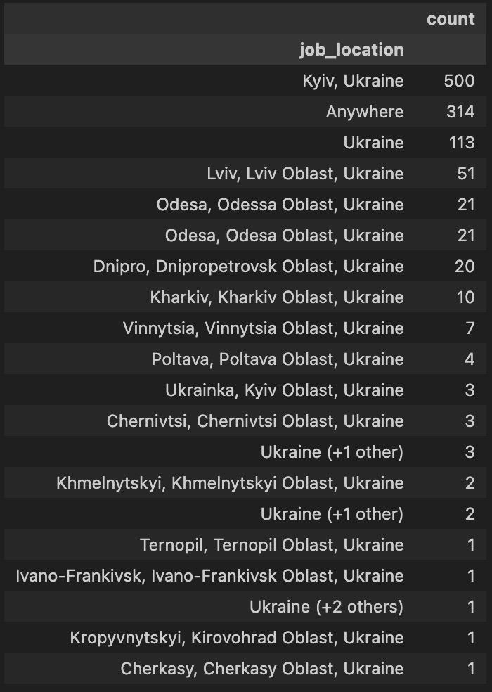
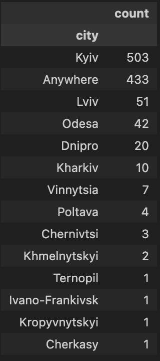

# Deep diving into Data Analysis with Python

### Overview and main goal 


In my search for a comprehensive Python guide to data analysis, I stumbled upon [Luke Barousse's YouTube channel](https://www.youtube.com/@LukeBarousse), and it was a stroke of luck. His easygoing teaching style and clear explanations made this course perfect for beginners like me. The course was also up-to-date, having been released only a few months ago. So, I jumped at the chance to learn data analysis with Python.

Using data from [Luke Barousse's Python course](https://lukebarousse.com/python), I conducted an analysis of job titles, salaries, locations, and essential skills. Through a series of Python scripts, I explored key questions such as job trends, the most in-demand skills in the field of data analytics in Ukraine.


### Core Questions
1. What are the cities with the most job opportunities for data professionals? 
2. What are the most sought-after skills for Data Scientists, Data Engineers, and Data Analysts?
3. How have the in-demand skills for Data Analysts evolved over time in 2023?
4. What skills offer the best combination of high demand and high earning potential for Data Analysts?
5. Which skills should aspiring and current Data Analysts prioritize to maximize their career prospects and earning potential?

### Key Tools

*For my data analysis project, I relied on the following tools:*

- **Python:** The core programming language for data manipulation and analysis. I used the Pandas library for data cleaning and manipulation, Matplotlib and Seaborn for data visualization.
- **Jupyter Notebooks:** An interactive environment that allowed me to combine code, visualizations, and explanatory text in a single document.
- **Visual Studio Code:** A powerful code editor for writing and running Python scripts.
- **Git & GitHub:** Version control tools for tracking changes and sharing my code with collaborators.


# Data Preparation and Processing

*This section details the data preparation steps to ensure accuracy and usability for analysis.*

## Import & Clean Up Data

```python
# Importing Libraries
import ast
import pandas as pd
import seaborn as sns
import numpy as np
from datasets import load_dataset
import matplotlib.pyplot as plt
from matplotlib.ticker import FuncFormatter
from adjustText import adjust_text


# Loading Data
dataset = load_dataset('lukebarousse/data_jobs')
df = dataset['train'].to_pandas()


# Data Cleanup
df['job_posted_date'] = pd.to_datetime(df['job_posted_date']) 

# Transform job_skills from str to list by using apply method
df['job_skills'] = df['job_skills'].apply(lambda x: ast.literal_eval(x) if pd.notna(x) else x)


```


After identifying key research questions, I narrowed down my analysis to the Ukrainian job market. I then selected the top 3 most sought-after Data Analyst roles and applied relevant filters to the dataset

```python
df_DA_UKR = df[(df['job_title_short'].isin(['Data Analyst', 'Data Scientist', 'Data Engineer'])) & (df['job_country'] == 'Ukraine')].copy()
```
The path wasn't easy and I started from this:
```python
df_DA_UKR['job_location'].value_counts().to_frame()

```



To this:




 *These seemingly simple steps were a daunting task for me, like venturing into uncharted territory.*


## 1. What are the cities with the most job opportunities for data professionals? 
-------

View my notebook with detailed steps here: [1_Exploratory_Data_Analysis_Intro](Data_Analysis_Project_Ukr/1_Exploratory_Data_Analysis_Intro.ipynb).

### Visualize Data


```python

df_DA_plot = df_DA_UKR['job_location'].value_counts().to_frame()

sns.set_theme(style='ticks')
sns.barplot(data=df_DA_plot, x='count', y='job_location', hue='count', palette='dark:#5A9_r', legend= False)
sns.despine()
plt.suptitle('Counts of Job Locations in Ukraine', fontsize=14)
plt.title('For Data Analysts, Data Engineers, Data Scientists', fontsize=10)
plt.xlabel('Number of Jobs', fontsize=10)
plt.ylabel('')
plt.xticks(range(0, 600, 50))
plt.show()
```

### Results


---------

### Insights:

The capital city, Kyiv, clearly stands out as the primary job market hub for data professionals in Ukraine. It has over 500 job openings, which is significantly higher than any other location.
Remote Work Opportunities or "Anywhere" category is indicating a growing trend in flexible work arrangements due to war. 


## 2. What are the most sought-after skills for Data Scientists, Data Engineers, and Data Analysts?
-----
I wanted to know which skills are most in-demand for the top 3 most popular data jobs. I picked the most popular job titles and found the top 10 skills for each one. This helps me see which skills I should focus on to get the job I want.

View my notebook with detailed steps here: [3_Skills_Requirements](Data_Analysis_Project_Ukr/3_Skills_Requirements.ipynb).


### Visualize Data

```python
fig, ax = plt.subplots(len(job_titles), 1, figsize=(12, 10))

sns.set_theme(style='ticks')

for i, job_titles in enumerate(job_titles):
    df_plot = df_skills_perc[df_skills_perc['job_title_short'] == job_titles].head(10)
    #df_plot.plot(kind='barh', x='job_skills', y='skill_percent', ax=ax[i], title=job_titles)
    sns.barplot(data=df_plot, x='skill_percent', y='job_skills', ax=ax[i], hue='skill_count', palette='dark:b_r')
    ax[i].set_title(job_titles)
    ax[i].set_ylabel('')
    ax[i].set_xlabel('')
    ax[i].get_legend().remove()
    ax[i].set_xlim(0, 70)


    for n, v, in enumerate(df_plot['skill_percent']):
        ax[i].text(v + 1, n, f'{v:.0f}%', va='center')
    
    if i != len(job_titles) - 1:
        ax[i].set_xticks([])


fig.suptitle('Percentage of likelihood Skills in Job Postings in Ukraine 2023', fontsize=15)
fig.tight_layout()
plt.show()
```
### Results


### Insights:
Overall, this plot provides valuable insights into the skills that are most in-demand in the Ukrainian job market for data-related roles in 2023. It highlights the importance of a strong foundation in SQL and Python, as well as the growing need for skills in big data technologies, cloud platforms, and machine learning. Python and SQL are the most sought-after skills across all three roles: Data Analyst, Data Engineer, and Data Scientist. Other important skills include big data technologies (Spark, Airflow, Kafka), cloud platforms (AWS, Azure), and machine learning libraries (TensorFlow, Pandas, PyTorch).